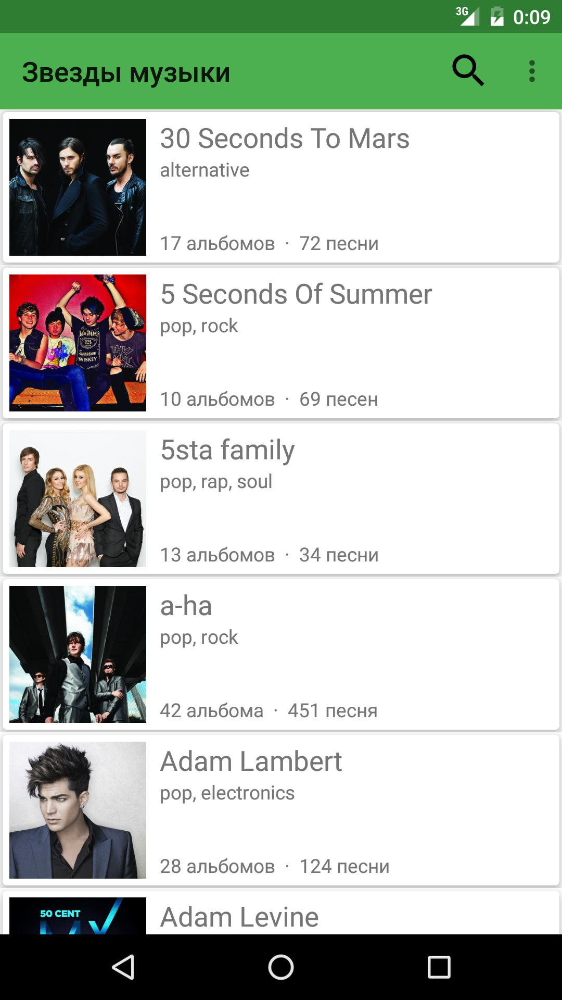
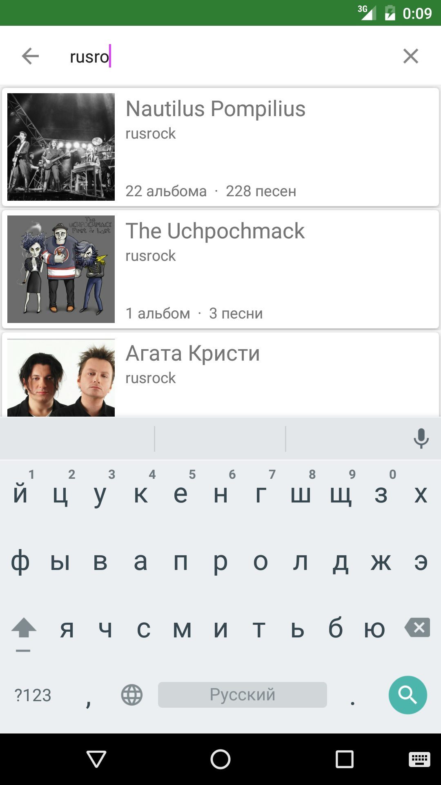
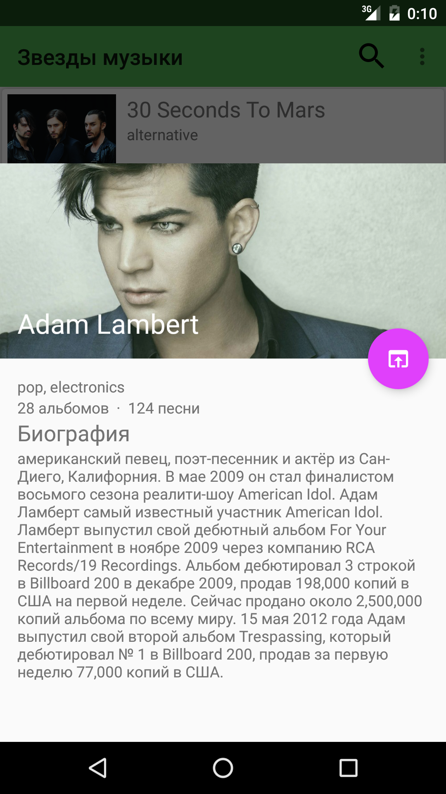

# YMDSStars

Приложение для поступления в школу мобильной разработки в Яндексе

  
  
  

Использованные библиотеки:
* com.miguelcatalan:materialsearchview
* commons-io:commons-io
* com.klinkerapps:sliding-activity
* com.squareup.picasso:picasso
* com.yandex.android:mobmetricalib
